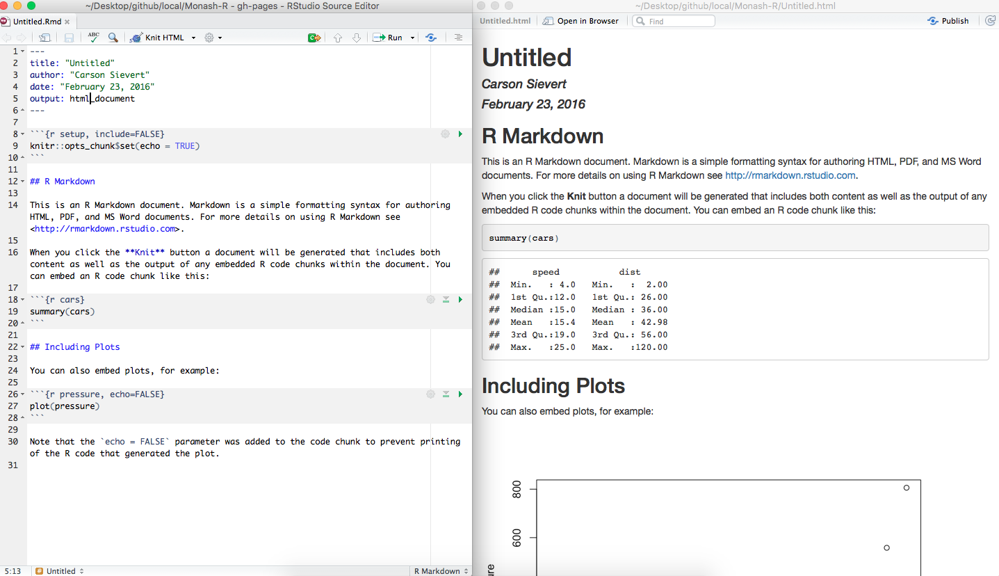

```{r setup, include = FALSE}
knitr::opts_chunk$set(
  message = FALSE,
  cache = FALSE,
  fig.height = 2,
  fig.width = 5,
  collapse = TRUE,
  comment = "#>"
)
```

## Research environment

- Collaboration and sharing with `git`
- Scripting your analysis 
- Keeping your code, data and documentation all together

## Collaboration with git

- At some point you are going to want to share your code, your proposal, your slides, your thesis with your advisor(s) --> github makes this easy and safe (even if your advisor doesn't know git)
- git is a VERSION CONTROL SYSTEM, keeps track of changes, merges changes from multiple people, allows switch back to previous version
- github provides additional support that can be really help in keeping your work organised, and getting feedback from your advisor - CAN BE A PRIVATE REPO
- git client's, like [gitkracken](https://www.gitkraken.com) provide a friendly interface to using git
- You can have some files as "tracked" and others as "untracked". Handy for if you have really large data, or proprietary data, the data would be untracked, you have a local copy in your local directory, collaborators can have a copy of the data, but the server does not have a copy.

## R is ...

* __Free__ to use
* __Extensible__
    * Over 10000 user contributed add-on packages currently on CRAN!
* __Powerful__
    * With the right tools, get more work done, faster and better.
* __Flexible__
    * Not a question of _can_, but _how_.
* __Frustrating__
    * So choices, so many options, easy to feel lost.
* __The language of data analysis__

```{r, eval = FALSE, echo = FALSE}
# devtools::install_github("metacran/crandb")
# pkgs <- crandb::list_packages(limit = 999999)
# length(pkgs)
# [1] 10419
```

## R does ...

* __Graphics, statistics, machine learning, etc.__
* __Data acquisition, munging, management__
* __Literate programming (dynamic reports)__
* __Web applications__


## RStudio is ...

[From Julie Lowndes](http://jules32.github.io/resources/RStudio_intro/):  

<blockquote>
<b>If R were an airplane, RStudio would be the airport</b>, providing many, many supporting services that make it easier for you, the pilot, to take off and go to awesome places. Sure, you can fly an airplane without an airport, but having those runways and supporting infrastructure is a game-changer.
</blockquote>

## The RStudio IDE

<div class="columns-2">
1. Source editor
    - Docking station for multiple files
    - Useful shortcuts ("Knit")
    - Highlighting/Tab-completion
    - Code-checking (R, HTML, JS)
    - Debugging features
2. Console window
    - Highlighting/Tab-completion
    - Search recent commands
3. Other tabs/panes
    - Graphics
    - R documentation
    - Environment pane
    - File system navigation/access
    - Tools for package development, git, etc
<div>

## Package installation

```{r eval=FALSE}
# From CRAN
install.packages("package_name")
# From github
devtools::install_github("github_username/package_name")
# From bioconductor
source("https://bioconductor.org/biocLite.R")
biocLite("package_name")
```

## Get a copy of the course materials

Slides and material can be found at [https://github.com/dicook/Monash-R_2017](http://dicook.github.io/Monash-R_2017/).

- Go to [https://github.com/dicook/Monash-R_2017]
- Download a zip copy of the repo
- Unzip it

## Create a project

Create a project to contain all of the material covered in this set of tutorials:

* File -> New Project -> Existing Directory -> Monash-R_2017

 

## Projects

When a project is opened within RStudio the following actions are taken:

- A new R session (process) is started
- The `.Rprofile` file in the project's main directory (if any) is sourced by R
- The `.RData` file in the project's main directory is loaded (if project options indicate that it should be loaded).
- The `.Rhistory` file in the project's main directory is loaded into the RStudio History pane (and used for Console Up/Down arrow command history).
- The current working directory is set to the project directory.
- Previously edited source documents are restored into editor tabs
- Other RStudio settings (e.g. active tabs, splitter positions, etc.) are restored to where they were the last time the project was closed.

## Why?

- Projects keep your work organised and specific for different tasks, e.g. honours thesis, coursework, research assistant work, charity work, your own startup, ...
- Organising your work in a project, sets up the ability to make directories relative to this workspace, e.g. NO NEED TO USE `read.csv(C:/Documents and Settings/Adele/Honours/data/SkyFall.csv`, simply address data as `read.csv("data/SkyFall.csv")`
- Less chance of having conflicts in data names, results, ... easier to keep clean
- Better than using `setwd()`, `getwd()`

## Hello R Markdown!

* File -> New File -> R Markdown -> OK -> Knit HTML

<div align="center">
  
</div>

Save the Rmd file into the "student_files" directory

## What is R Markdown?

- From the [R Markdown home page](http://rmarkdown.rstudio.com/):

<blockquote>
R Markdown is an authoring format that enables easy creation of dynamic documents, presentations, and reports from R. It combines the core syntax of __markdown__ (an easy-to-write plain text format) __with embedded R code chunks__ that are run so their output can be included in the final document. R Markdown documents are fully reproducible (they can be automatically regenerated whenever underlying R code or data changes).
</blockquote>

- RStudio's [Rmarkdown cheatsheet](https://www.rstudio.com/wp-content/uploads/2016/03/rmarkdown-cheatsheet-2.0.pdf) gives a nice, concise overview of its capabilities.

- RStudio's [reference guide](https://www.rstudio.com/wp-content/uploads/2015/03/rmarkdown-reference.pdf) lists its options.


## For your reference

- Open the document `index.Rmd` which generates these slides in RStudio
- Run all the chunks up until this point

## Other output formats, other code 

- Output can be html (this), Word, pdf (you need latex installed)
- Code chunks can be other languages, e.g. python, SAS, 

## Obligatory economics example

```{r}
data(economics, package = "ggplot2")
# data frames are essentially a list of vectors
str(economics)
```

## Your turn


Read the documentation for `economics`. Can you think of a interesting/informative function of these variable(s)?

## Hello ggplot2

```{r, fig.height = 3, fig.width = 10}
library(ggplot2)
p <- ggplot(economics, aes(date, unemploy / pop)) + 
  geom_line()
p
```

## Grammar of graphics

- `ggplot2` builds plots using a grammar
- This is analogous to doing a functional mappings that define statistics, e.g. $\bar{X} = \sum_{i=1}^{n}X_i/n$
- Start with tidy data, where variables are clearly defined
- Map variables to aesthetics e.g. x axis, y axis, colour
- Apply a geom, e.g. point, line, boxplot
- Use a coordinate system
- Facet, split into subplots
- Add themes, annotations, ...
- A data plot becomes a statistic, and it is possible to compare and contrast different plots

## Hello Linear/Additive Models!

```{r, fig.show = 'hold'}
p
p + geom_smooth(method = "lm", se = F)
p + geom_smooth(method = "loess", se = F)
p + geom_smooth(method = "gam", formula = y ~ s(x, bs = "cr"), se = F)
```

## How does `geom_smooth()` work?

```{r}
m <- lm((unemploy / pop) ~ date, data = economics)
str(m)
```

---

```{r, fig.height = 4.5, fig.width = 10}
economics$yhat <- m$fitted.values
p <- ggplot(economics) + 
  geom_line(aes(date, unemploy / pop)) +
  geom_line(aes(date, yhat), color = "blue")
p
```

## Interactive and web-based!

```{r, fig.height = 4.5, fig.width = 10, fig.align = "center"}
library(plotly)
ggplotly(p)
```

## Tidy data

Tidy data is organised so that variables and observations are clearly identified. 

```{r}
library(tidyr)
library(readr)
tb <- read_csv("../data/tb.csv")
head(tb)
```

---

```{r, fig.height = 5.5, fig.width = 10}
str(tb)
```

What do you think m_04, m_514, m_014, ... mean?

## Your turn


- What are the variables in this data?
- What are the observations?

## Tidying

```{r}
tb %>% gather(var, count, -year, -iso2)
```

---

```{r}
tb %>% gather(var, count, -year, -iso2) %>%
  separate(var, c("gender", "age"))
```

---

```{r}
library(dplyr)
tb_long <- tb %>% gather(var, count, -year, -iso2) %>%
  separate(var, c("gender", "age"))
tb_long %>% group_by(year, gender) %>% tally()
```

## A new example: babynames

```{r}
library(babynames)
head(babynames)
dim(babynames)
```

## Get other formats into R

```{r, eval = FALSE}
library(readxl)
read_excel("my-spreadsheet.xls", sheet = "data")
read_excel("my-spreadsheet.xls", sheet = 2)
```

```{r, eval = FALSE}
library(haven)
# SAS files
read_sas("path/to/file")
# SPSS files
read_por("path/to/file")
read_sav("path/to/file")
# Stata files
read_dta("path/to/file")
```

## Read json format data from the web

Extracted from [http://openexchangerates.org](http://openexchangerates.org), extracted using the json api, with the R package, jsonlite.

```{r}
library(readr)
rates <- read_csv("../data/rates.csv")
rates[1:5,1:8]
```

If you'd like to collect exchange rates yourself, see [here](https://gist.github.com/cpsievert/e05da83fc4253e6d1986).

## Getting maps

```{r}
library(ggmap)
library(ggthemes)
m <- get_map(location=c(145.13, -37.9150), zoom=14, scale=1)
```
---

```{r fig.width=7, fig.height=7}
ggmap(m) + theme_map() + 
  theme(legend.position="none", aspect.ratio=1)
```

## Getting spatial data

```{r}
library(maptools)
sF <- readShapeSpatial("../data/australia/region.shp")
library(rmapshaper)
sFsmall <- ms_simplify(sF, keep=0.05)
nat_map <- ggplot2::fortify(sFsmall)
head(nat_map)
```

---

```{r}
ggplot(nat_map) +
  geom_map(aes(map_id = id), map=nat_map) +
  expand_limits(x=nat_map$long, y=nat_map$lat) + 
  theme_map()
```


## Resources

* Materials at [http://dicook.github.io/Monash-R_2017/](http://dicook.github.io/Monash-R/)
* Resources at [RStudio](https://www.rstudio.com/resources/training/online-learning/)
* RStudio's [IDE cheat sheet](https://www.rstudio.com/wp-content/uploads/2016/01/rstudio-IDE-cheatsheet.pdf).
* RStudio's [Rmarkdown cheat sheet](https://www.rstudio.com/wp-content/uploads/2016/03/rmarkdown-cheatsheet-2.0.pdf).
* RStudio's [Reading data cheat sheet](https://github.com/rstudio/cheatsheets/raw/master/source/pdfs/data-import-cheatsheet.pdf).
* Jenny Bryan's [git tutorial](http://happygitwithr.com) and [how to ask questions so they get answered](https://github.com/jennybc/reprex)
* [stackoverflow](http://stackoverflow.com) Q&A site for coding
* [crossvalidated](http://stats.stackexchange.com) Q&A site for statistics

## Share and share alike

This work is licensed under the Creative Commons Attribution-Noncommercial 3.0 United States License. To view a copy of this license, visit http://creativecommons.org/licenses/by-nc/ 3.0/us/ or send a letter to Creative Commons, 171 Second Street, Suite 300, San Francisco, California, 94105, USA.
