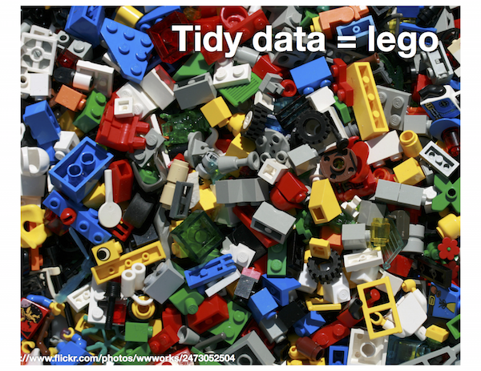
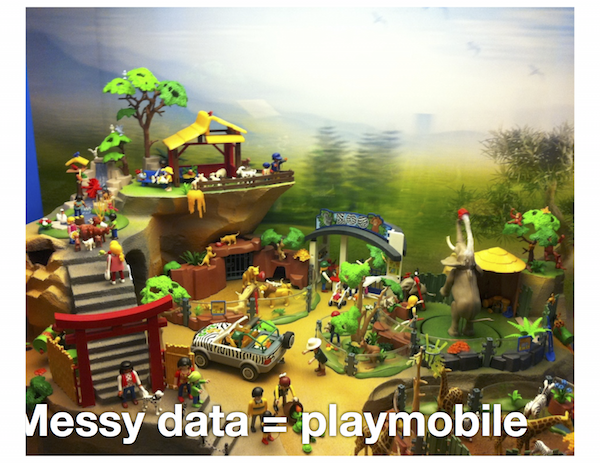

```{r, echo = FALSE}
library(knitr)
opts_chunk$set(
  message = FALSE,
  warning = FALSE,
  collapse = TRUE,
  comment = "#>",
  fig.height = 4,
  fig.width = 8,
  fig.align = "center",
  cache = FALSE
)
options(digits = 2)
```


## Warmups - Problem 1

10 week sensory experiment, 12 individuals assessed taste of french fries on several scales (how potato-y, buttery, grassy, rancid, paint-y do they taste?), fried in one of 3 different oils, replicated twice. First few rows:

```{r, echo = FALSE}
library(tidyr)
library(dplyr)
library(readr)
data(french_fries, package = "reshape2")
kable(head(french_fries, 4), format = "markdown", row.names = F)
```

What do you want to know?

## Warmups - Problem 2

What's in the column names of this data?

```{r, echo=FALSE}
genes <- read_csv("../data/genes.csv")
kable(genes)
```

## Warmups - Problem 3

What are the variables? What are the records?

```{r}
melbtemp <- read.fwf("../data/ASN00086282.dly", 
   c(11, 4, 2, 4, rep(c(5, 1, 1, 1), 31)), fill=T)
kable(head(melbtemp[,c(1,2,3,4,seq(5,128,4))]))
```

## Warmups - Problem 4

What are the variables? What are the observations?

```{r}
pew <- read.delim(
  file = "http://stat405.had.co.nz/data/pew.txt",
  header = TRUE,
  stringsAsFactors = FALSE,
  check.names = F
)
kable(pew[1:5, 1:5])
```

## What we are going to cover today

- Reading different data formats
- Tidying data
- Split - apply - combine
- Working with dates
- Plotting your data

## French fries - hot chips

10 week sensory experiment, 12 individuals assessed taste of french fries on several scales (how potato-y, buttery, grassy, rancid, paint-y do they taste?), fried in one of 3 different oils, replicated twice. First few rows:


```{r, echo=FALSE, results='asis'}
kable(head(french_fries), format = "markdown", row.names = FALSE)
```

## What would we like to know?

- Is the design complete?
- Are replicates like each other?
- How do the ratings on the different scales differ?
- Are raters giving different scores on average?
- Do chips taste more rancid over the weeks?

Each of these questions involves different summaries of the data.

## What we have and what we want

<div align="center">
  
</div>

## Gathering

- When gathering, you need to specify the **keys** (identifiers) and the **values** (measures).

Keys/Identifiers:
- Identify a record (must be unique)
- Example: Indices on an random variable
- Fixed by design of experiment (known in advance)
- May be single or composite (may have one or more variables)

Values/Measures:
- Collected during the experiment (not known in advance)
- Usually numeric quantities

## Gathering the French Fries

```{r}
library(tidyr)
ff_long <- gather(french_fries, key = variable, value = rating, potato:painty)
head(ff_long)
```

## Long to Wide

In certain applications, we may wish to take a long dataset and convert it to a wide dataset (Perhaps displaying in a table).

This is called "spreading" the data.

## Spread

We use the **spread** function from tidyr to do this:

```{r}
french_fries_wide <- spread(ff_long, key = variable, value = rating)

head(french_fries_wide)
```

## Lets use gather and spread to answer some questions

Easiest question to start is whether the ratings are similar on the different scales, potato'y, buttery, grassy, rancid and painty. 

We need to gather the data into long form, and make plots facetted by the scale. 

## Ratings on the different scales

```{r, fig.height=2, fig.width=8}
library(ggplot2)
ggplot(data=ff_long, aes(x=rating)) + 
  geom_histogram(binwidth=2) + 
  facet_wrap(~variable, ncol=5) 
```

## Side-by-side boxplots

```{r}
ggplot(data=ff_long, aes(x=variable, y=rating)) + 
  geom_boxplot() 
```

## Do the replicates look like each other?

We will start to tackle this by plotting the replicates against each other using a scatterplot. 

We need to gather the data into long form, and then get the replicates spread into separate columns. 

## Check replicates

```{r, fig.show='hold', fig.align='default', fig.height=4, fig.width=4}
ff.s <- ff_long %>% spread(rep, rating)
head(ff.s)
```

## Check replicates

```{r, fig.show='hold', fig.align='default', fig.height=3, fig.width=3}
p <- ggplot(data=ff.s, aes(x=`1`, y=`2`)) + 
  geom_point(alpha=0.5) +
  theme(aspect.ratio=1) + 
  xlab("Rep 1") + ylab("Rep 2")
p
p + scale_x_sqrt() + scale_y_sqrt()
```

## Your turn


Make the scatterplots of reps against each other separately for scales, and treatment. 

```{r, echo=FALSE}
p + facet_wrap(~variable, ncol=5)
p + facet_grid(treatment~variable)
```

## Are raters giving different scores on average?

```{r fig.height=4.5, fig.width=9}
ggplot(ff_long, aes(x=subject, y=rating)) + 
  geom_boxplot() + facet_wrap(~variable)
```

---

OR

```{r fig.height=4.5, fig.width=9}
ggplot(ff_long, aes(x=variable, y=rating)) + 
  geom_boxplot() + facet_wrap(~subject)
```

## Legos = tidy data



(Courtesy of Hadley Wickham)

## Play mobile = messy data



(Courtesy of Hadley Wickham)

## Your turn


Read in the billboard top 100 music data, which contains N'Sync and Backstreet Boys songs that entered the billboard charts in the year 2000

```{r}
billboard <- read.csv("../data/billboard.csv")
```

What's in this data? What's X1-X76?

## Your turn


1. Use `tidyr` to convert this data into a long format appropriate for plotting a time series (date on the x axis, chart position on the y axis)
2. Use `ggplot2` to create this time series plot:

```{r, echo=FALSE, fig.height=3}
long_billboard <- gather(billboard, key = week, value = rank, X1:X76)
long_billboard$week <- as.numeric(gsub("X", "", long_billboard$week))

ggplot(data = long_billboard, aes(week, rank)) + 
  geom_line(aes(colour = artist, group = track))
```


## The Split-Apply-Combine Approach


(Diagram originally from Hadley Wickham)

## Split-Apply-Combine in dplyr

```{r}
library(dplyr)
french_fries_split <- group_by(ff_long, variable) # SPLIT
french_fries_apply <- summarise(french_fries_split, rating = mean(rating, na.rm = TRUE)) # APPLY + COMBINE
french_fries_apply
```

## The pipe operator

- dplyr allows us to chain together these data analysis tasks using the `%>%` (pipe) operator
- `x %>% f(y)` is shorthand for `f(x, y)`
- Example:

```{r}
french_fries %>%
    gather(key = variable, value = rating, potato:painty) %>%
    group_by(variable) %>%
    summarise(rating = mean(rating, na.rm = TRUE))
```

## dplyr verbs
 
There are five primary dplyr **verbs**, representing distinct data analysis tasks:

- Filter: Remove the rows of a data frame, producing subsets
- Arrange: Reorder the rows of a data frame
- Select: Select particular columns of a data frame
- Mutate: Add new columns that are functions of existing columns
- Summarise: Create collapsed summaries of a data frame
    
## Filter

```{r}
french_fries %>%
    filter(subject == 3, time == 1)
```

## Arrange

```{r}
french_fries %>%
    arrange(desc(rancid)) %>%
    head
```

## Select

```{r}
french_fries %>%
    select(time, treatment, subject, rep, potato) %>%
    head
```

## Summarise

```{r}
french_fries %>%
    group_by(time, treatment) %>%
    summarise(mean_rancid = mean(rancid), sd_rancid = sd(rancid))
```

## Let's use these tools to answer the rest of the french fries questions

If the data is complete it should be 12 x 10 x 3 x 2, that is, 6 records for each person. (Assuming that each person rated on all scales.) 

To check this we want to tabulate the number of records for each subject, time and treatment. This means select appropriate columns, tabulate, count and spread it out to give a nice table.

## Check completeness

```{r}
french_fries %>% 
  select(subject, time, treatment) %>% 
  tbl_df() %>% 
  count(subject, time) %>%
  spread(time, n)
```

## Check completeness with different scales, too

```{r}
ff_long %>% 
  select(subject, time, treatment, variable) %>% 
  count(subject, time) %>%
  spread(time, n)
```

## Change in rancid ratings over weeks

```{r}
p <- ff_long %>% filter(variable == "rancid") %>%
  ggplot(aes(x=time, y=rating, colour=treatment)) + 
         geom_point(alpha=0.5) +
  facet_wrap(~subject) 
p
```

## Add means over reps, and connect the dots

```{r}
ff.av <- ff_long %>% 
  filter(variable == "rancid") %>%
  group_by(subject, time, treatment) %>%
  summarise(rating=mean(rating))
p + geom_line(data=ff.av, aes(group=treatment))
```

## String manipulation

When the experimental design is packed into column names, we need to unpack it. 

```{r}
genes <- read_csv("../data/genes.csv")
genes
```

## Gather column names into long form

```{r}
gather(genes, variable, expr, -id)
```

## Separate columns

```{r}
genes %>%
  gather(variable, expr, -id) %>%
  separate(variable, c("trt", "leftover"), "-")
```

---

```{r}
genes %>%
  gather(variable, expr, -id) %>%
  separate(variable, c("trt", "leftover"), "-") %>%
  separate(leftover, c("time", "rep"), "\\.")
```

---

```{r}
gtidy <- genes %>%
  gather(variable, expr, -id) %>%
  separate(variable, c("trt", "leftover"), "-") %>%
  separate(leftover, c("time", "rep"), "\\.") %>%
  mutate(trt = sub("W", "", trt)) %>%
  mutate(rep = sub("R", "", rep))
gtidy
```

## Your turn


(1) Using the tidied dataset (`gtidy`), find the mean expression for each combination of id, trt, and time.
(2) Use this tidied data to make this plot.

```{r, echo=FALSE, fig.height=3}
gmean <- gtidy %>% 
  group_by(id, trt, time) %>% 
  summarise(expr = mean(expr))
gmean
ggplot(data = gtidy, 
       aes(x=trt, y=expr, colour = time)) + 
  geom_point() +
  xlab("Type of modification") +
  ylab("Expression") + 
  facet_wrap(~id) +
  geom_line(data = gmean, aes(group = time))
```


## Dates and Times

Dates are deceptively hard to work with in R.

**Example**: 02/05/2012. Is it February 5th, or May 2nd?

Other things are difficult too:

- Time zones
- POSIXct format in base R is challenging

The **lubridate** package helps tackle some of these issues.

## Basic Lubridate Use

```{r}
library(lubridate)

now()
today()
now() + hours(4)
today() - days(2)
```

## Parsing Dates

```{r}
ymd("2013-05-14")
mdy("05/14/2013")
dmy("14052013")
ymd_hms("2013:05:14 14:5:30", tz = "America/New_York")
```

## Flight Dates

```{r}
library(nycflights13)
head(flights)
f <- flights %>%
  mutate(date = paste(year, month, day, sep = "-")) %>%
  mutate(date2 = ymd(date)) %>%
  select(date, date2)
```

## Your turn


What's the difference between `date` and `date2`?

## Use date to plot over time

```{r fig.width=9, fig.height=3}
ff_day <- flights %>% 
  mutate(date = paste(year, month, day, sep = "-")) %>%
  mutate(date = ymd(date)) %>%
  group_by(date) %>%
  tally()
ggplot(ff_day, aes(x=date, y=n)) + geom_line()
```

## By day of the week

```{r fig.width=9, fig.height=3}
ff_day <- ff_day %>%
  mutate(day=wday(date, label = TRUE, abbr = TRUE))
ggplot(ff_day, aes(x=day, y=n)) + geom_boxplot()
```

## Hours and minutes

Use the `ymd_hms()` function to make a date time that incorporates hours and minutes (__bonus__: why can't `ymd_hms()` parse every date time?)

## Date times

```{r, warning = TRUE}
flights <- flights %>%
  mutate(date = paste(year, month, day, sep = "-")) %>%
  mutate(time = paste(hour, minute, "0", sep = ":")) %>%
  mutate(dt = ymd_hms(paste(date, time))) 
```

## Fitting models across groups

If your apply function returns anything but a single value, use `do()` instead of `summarise()`

```{r}
library(purrr)
models <- flights %>%
  split(.$carrier) %>%
  map(~lm(dep_delay ~ hour, data = .)) %>%
  map_df(coefficients) %>% 
  t() %>% data.frame()
models
```

---

```{r fig.width=9, fig.height=4}
ggplot(flights, aes(x=hour, y=dep_delay)) + 
  geom_point(alpha=0.5) + 
  geom_smooth(method="lm", se=F) +
  facet_wrap(~carrier)
```

## Your turn


- What does the intercept mean here?
- Should you transform the departure delay?

## Themes

```{r echo=FALSE}
ff.av.86 <- ff_long %>% 
  filter(variable == "rancid", subject==86) %>%
  group_by(subject, time, treatment) %>%
  summarise(rating=mean(rating))
p <- ff_long %>% filter(variable == "rancid", subject==86) %>% 
  ggplot(aes(x=time, y=rating, colour=treatment)) + 
         geom_point(alpha=0.5) +
  geom_line(data=ff.av.86, aes(group=treatment))
```

```{r}
library(ggthemes)
p + theme_tufte()
```

---

```{r}
p + theme_economist()
```

## Color palettes

```{r}
p + scale_color_brewer("", palette = "Dark2")
```

## Color blind-proofing

```{r, fig.width=4.5, fig.show='hold', fig.align='default'}
library(dichromat)
library(scales)
clrs <- hue_pal()(3)
p + scale_color_manual("", values=clrs) + theme(legend.position = "none")
clrs <- dichromat(hue_pal()(3))
p + scale_color_manual("", values=clrs) + theme(legend.position = "none")
```

---

```{r, fig.width=4.5, fig.show='hold', fig.align='default'}
library(RColorBrewer)
clrs <- brewer.pal(3, "Dark2")
p + scale_color_manual("", values=clrs) + theme(legend.position = "none")
clrs <- dichromat(brewer.pal(3, "Dark2"))
p + scale_color_manual("", values=clrs) + theme(legend.position = "none")
```

## Color palettes

- Qualitative: categorical variables
- Sequential: low to high numeric values
- Diverging: negative to positive values

---

```{r, echo=FALSE, fig.height=7, fig.width=12}
display.brewer.all()
```

## Perceptual principles

- Hierarchy of mappings: (first) position along an axis - (last) color (Cleveland, 1984; Heer and Bostock, 2009)
- Pre-attentive: Some elements are noticed before you even realise it.
- Color: (pre-attentive) palettes - qualitative, sequential, diverging.
- Proximity: Place elements for primary comparison close together. 
- Change blindness: When focus is interrupted differences may not be noticed.

## Pre-attentive

Can you find the odd one out?

```{r echo=FALSE}
df <- data.frame(x=runif(100), y=runif(100), cl=sample(c(rep("A", 1), rep("B", 99))))
ggplot(data=df, aes(x, y, shape=cl)) + geom_point() +
  theme_bw() + theme(legend.position="None", aspect.ratio=1)
```

---

Is it easier now?

```{r echo=FALSE}
ggplot(data=df, aes(x, y, colour=cl)) + geom_point() + 
  theme_bw() + theme(legend.position="None", aspect.ratio=1)
```

## Resources

- [Data wrangling heat sheet](https://github.com/rstudio/cheatsheets/raw/master/source/pdfs/data-transformation-cheatsheet.pdf)
- [Plotting data cheat sheet](https://www.rstudio.com/wp-content/uploads/2016/11/ggplot2-cheatsheet-2.1.pdf)
- [ggplot2: Elegant Graphics for Data Analysis, Hadley Wickham](http://ggplot2.org/book/), [web site](http://ggplot2.org)
- [R Graphics Cookbook, Winston Chang](http://www.cookbook-r.com/Graphs/)
- [Naomi Robbins, Creating More Effective Graphs](http://www.nbr-graphs.com)
- [Antony Unwin, Graphical Data Analysis with R](https://www.crcpress.com/Graphical-Data-Analysis-with-R/Unwin/9781498715232)

## Share and share alike

This work is licensed under the Creative Commons Attribution-Noncommercial 3.0 United States License. To view a copy of this license, visit http://creativecommons.org/licenses/by-nc/ 3.0/us/ or send a letter to Creative Commons, 171 Second Street, Suite 300, San Francisco, California, 94105, USA.
